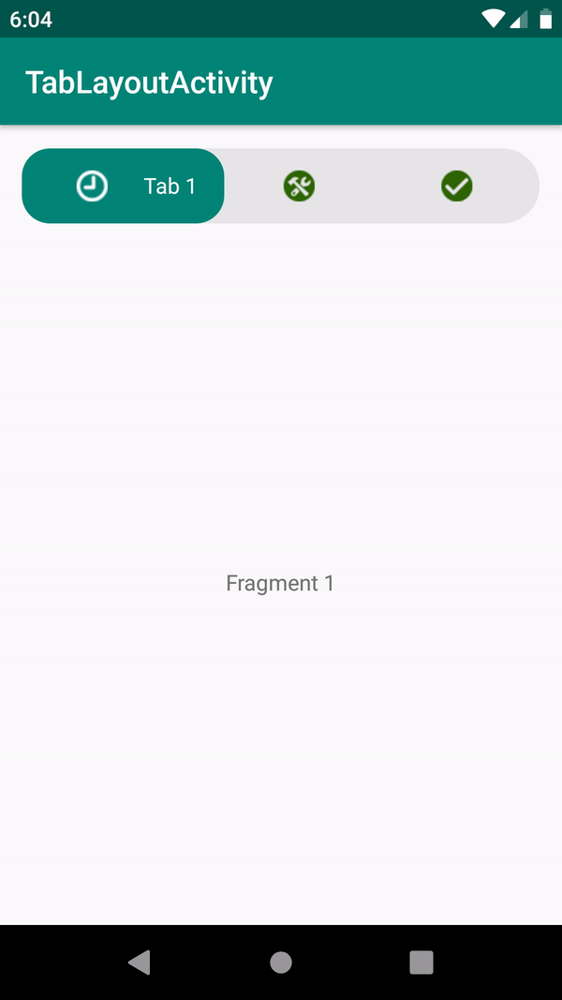

# TabLayout
  
  An Android material tab layout with Icons and text,if the current tab is selected then only the text will be visible.
  
  Do the following code in TabLayout's addOnTabSelectedListener
  
 ```ruby
 binding.tabLayout.addOnTabSelectedListener(new TabLayout.OnTabSelectedListener() {
            @Override
            public void onTabSelected(TabLayout.Tab tab) {

                LinearLayout linearLayout = (LinearLayout) tab.getCustomView();
                TextView text = linearLayout.findViewById(R.id.tabContent);
                ImageView img = linearLayout.findViewById(R.id.tabImg);

                if (text != null) {
                    text.setText(tabTitles[tab.getPosition()]);
                    img.setColorFilter(ContextCompat.getColor(context, R.color.white), android.graphics.PorterDuff.Mode.MULTIPLY);
                }
                img.setColorFilter(ContextCompat.getColor(context, R.color.white), android.graphics.PorterDuff.Mode.MULTIPLY);

                binding.viewPager.setCurrentItem(tab.getPosition());
            }

            @Override
            public void onTabUnselected(TabLayout.Tab tab) {

                LinearLayout linearLayout = (LinearLayout) tab.getCustomView();
                TextView tabContent = linearLayout.findViewById(R.id.tabContent);
                ImageView img = linearLayout.findViewById(R.id.tabImg);

                if (tabContent != null) {
                    tabContent.setText("");
                    img.setColorFilter(ContextCompat.getColor(context, R.color.dark_green), android.graphics.PorterDuff.Mode.MULTIPLY);
                }

            }

            @Override
            public void onTabReselected(TabLayout.Tab tab) {
                Log.e("TabPosition", "" + tab.getPosition());

            }
        });
```

  
  

